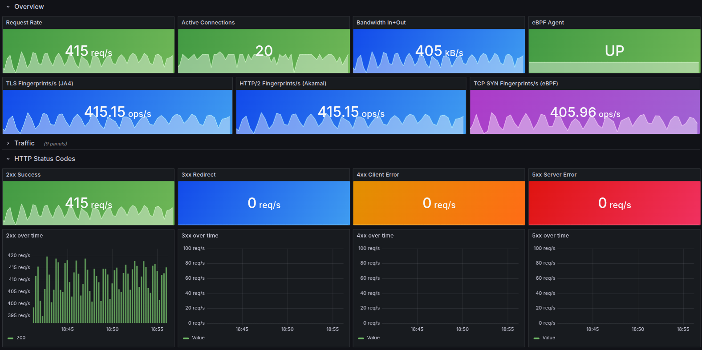

A pre-built **Prometheus + Grafana** stack ships with the repo. Grafana is pre-provisioned with a data source and a dashboard — no manual import or configuration needed.

Dashboard JSON: [`examples/grafana/dashboards/huginn-proxy.json`](https://github.com/biandratti/huginn-proxy/blob/master/examples/grafana/dashboards/huginn-proxy.json).



---

## Prerequisites

The **main proxy stack** must already be running and exposing ports on the host:

- **`9090`** — proxy metrics (`/metrics`, `/health`, `/ready`, `/live`)
- **`9091`** — eBPF agent metrics (only when using the TCP SYN stack)

Prometheus reaches both via `host.docker.internal` from inside the observability containers.

Not running the main stack yet? Start here: [Containers](/huginn-proxy/docs/containers/).

---

## Start the observability stack

Run from the **repo root** (not from `examples/`):

```bash
docker compose -f examples/docker-compose.observability.yml up -d
```

This starts **Prometheus** and **Grafana** as a separate Compose project. They scrape the proxy and the eBPF agent automatically.

---

## Open Grafana

1. Open **`http://localhost:3000`** in your browser.
2. Log in with **`admin` / `huginn`**.
3. The **Huginn Proxy** dashboard loads as the default home dashboard.

---

## What the dashboard covers

| Panel | What you see |
| --- | --- |
| **Overview** | Request rate, active connections, error rate (client view), P95 latency, bandwidth |
| **TLS** | Handshake rate, TLS version and cipher distribution, error rate, P95 handshake duration |
| **Fingerprinting** | JA4 and HTTP/2 (Akamai) extraction rate, failure rate, P95 extraction duration |
| **Rate limiting** | Evaluation rate, rejection rate, breakdowns by strategy and route |
| **Backends** | Request rate, error rate, P95 latency, throughput per backend, health probe results |
| **Config hot reload** | Reload success/error rate, time since last successful reload, active config hash |
| **eBPF agent** | Agent up, TCP SYN captured / insert failures / malformed (when eBPF stack is running) |

Full PromQL for each panel: **[TELEMETRY.md — Grafana Dashboard Suggestions](https://github.com/biandratti/huginn-proxy/blob/master/TELEMETRY.md#grafana-dashboard-suggestions)**.

---

## Prometheus scrape config (reference)

The observability Compose file already wires this up. For custom deployments:

```yaml
scrape_configs:
  - job_name: huginn-proxy
    static_configs:
      - targets: ["localhost:9090"]
    scrape_interval: 15s

  - job_name: huginn-ebpf-agent
    static_configs:
      - targets: ["localhost:9091"]
    scrape_interval: 15s
```

Adjust hosts to your Docker/Kubernetes networking. See [Telemetry](/huginn-proxy/docs/telemetry/) for the full metric reference.

## Related

- [Telemetry](/huginn-proxy/docs/telemetry/): metric names, labels, and PromQL examples
- [Containers](/huginn-proxy/docs/containers/): which stack to run first
- [Kubernetes](/huginn-proxy/docs/kubernetes/): health endpoints and scraping in K8s
